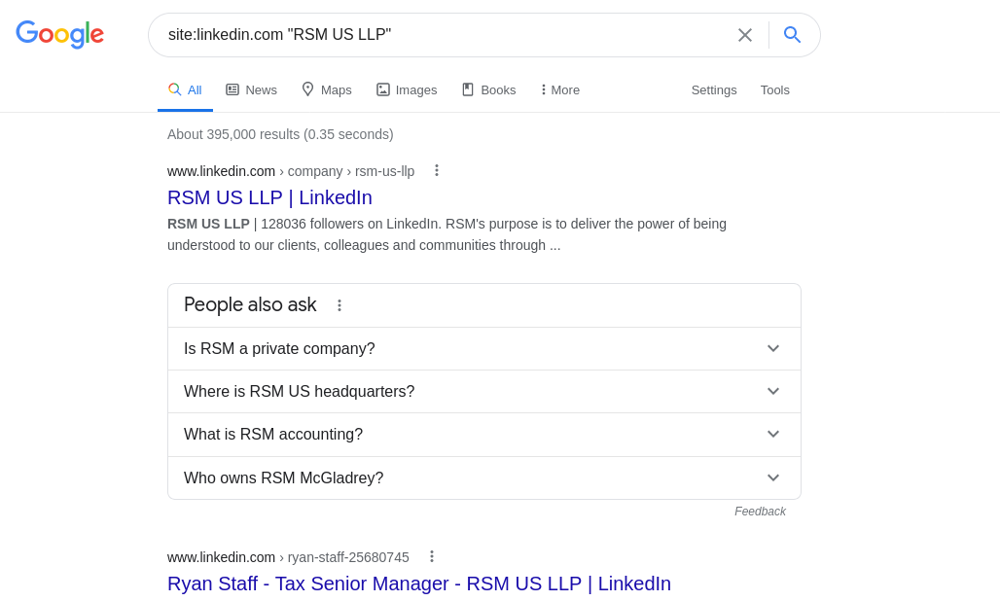

# getnames

Python3 script which performs a google dork for a company's likedin members and pushes
the names into a specified format.

Google detects scraping after two or three sequential queries, so try out the query yourself
before hand and be sure you are getting the right query.

An example of what it should look like:



Provide script with the company name as in the example and the email format you want the employee
emails in:

```
python3 getnames.py -c "Company Name" -e "<fn>.<ln>@companyemail.com"
```

